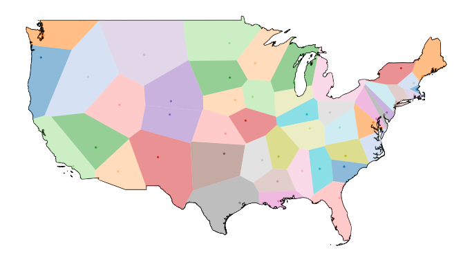
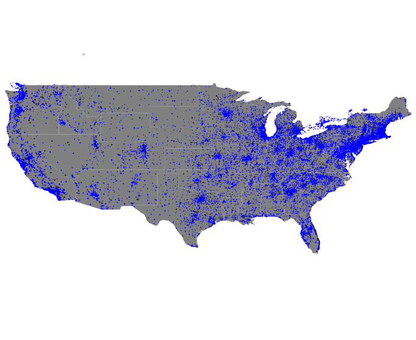
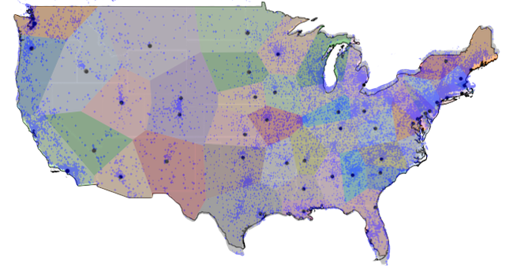

## Voronoi - Real World Use Case
#### Due: 03-01-2022 (Tuesday @ 9:30 a.m.)

### Overview

This assignment is an extension of the previous assignment. 

The [voronoi diagram](https://en.wikipedia.org/wiki/Voronoi_diagram), allows us to create polygons around each city to use as "ufo containers" for lack of a better term. Look at the image below:

We used a distance calculation from each city to the "nearest" 100 ufos in the previous assignment. However, with the crowded east coast, and the not so crowded west (California not withstanding), assigning UFO's to individual cities is not very straight-forward. Bring in the "voronoi" diagram. Voronoi diagrams create polygons around "seeds" (cities in our case) such that the lines making up each polygon are equidistant between any two given cities. Find any "side" of a polygon in the image above, and it will be halfway between two cities. 

I feel like the polygons that the voronoi diagram creates can be used to determine which Ufo's go to which cities. If the point location of a UFO is within that cities polygon, it gets assigned to that city. As I look at the ufo output above, I want to use a clustering algorithm to determine the "hot spots" of UFO sightings. Visually it's pretty easy, but actually doing so requires the use of a clustering algorithm like `k-means` or `db-scan`. If you compare the voronoi diagram above the ufo distribution image, you can see that some of the UFO sighting hotspots don't necessarily line up with cities in our voronoi diagram. Oh, well. That may be for a later assignment. 

But as you can see in the "not so perfect" merged images, we are missing some cites around UFO sighting hotspots. I can see groupings (clusters) in Texas, Florida, and Michigan without cities. Why do I assume cities should be at those clusters? Well, population = sightings. I bet we could run a clustering algorithm on the UFO sightings image, and we would discover that nearly all the dense spots of sightings would correspond with a city. But, again ... that's for a later date.

### Requirements

- Create a voronoi diagram over the US creating polygons around each of the 49 cities.
- Load said polygons into a spatial tree (geopandas rtree).
- Load each of the UFO sighting points into the same rtree.
- Query the rtree getting the UFO sighting points that are contained within each polygon.
- Save your results to a json file to be used later (maybe).

### Deliverables

- Create a folder called `P03` in your assignments folder on your repo.
- Add your file that contains all the UFO's within each polygon. 
- Your file should be in a json format, with the cityName as the key pointing to a list of ufo points.
- Create a readme in `P03` with a small write up explaining your mini project and each file. 
- Please refer to the [Readmees](../../Resources/02-Readmees/README.md) folder for help on creating a worthwhile readme.

