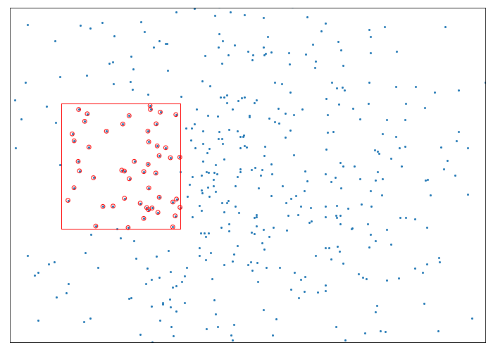
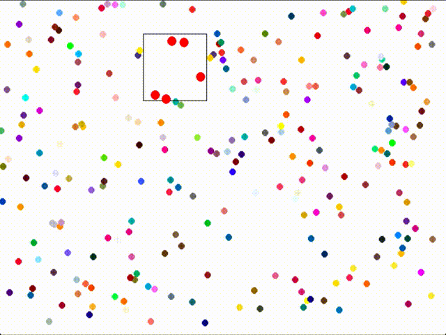

## Quadtree - Bounding Box Query
#### Due: 04-26-2022 (Tuesday @ 9:30 a.m.)

### Overview

This program is about querying a quadtree with a bounding rectangle. There is a method built in to the quadtree class that accepts a bounding box to query the points in the tree with. Because of the recursive nature of the quadtree in itself, you need to pass in the container you want populated with the results:

```python
results = []
bbox = Rect(400, 400, 300, 300)
query(bbox, results)
print(results) # will be populated with results
```

The results of the query will be a list of points found within the bounding box passed to the quadtree.

### Query Types

You will create a query rectangle in two different ways in order to query the tree: 
1. by drawing a rectangle with the mouse in some fashion
2. by moving a rectangle across the screen in a row wise fashion 

#### Method 1
With method one, you will simply draw the rectangle, and all points within the bounding rectangle will be highlighted in some way (color and size preferably). You can use keys to start the rectangle drawing process, instead of only using the mouse buttons. This might make it easier to get a rectangle drawn. Example below 



#### Method 2
With method two, a bounding box will traverse across the screen until it reaches the far right, then drop down half the height of the bounding rectangle and continue from the far left. The example below is clunky, but gives you the idea. Use the "Q" key to start this query window running. By hitting the "Q" key again, it will stop this query window. The size of your query window should be about 20% of the overall window size. 



The reason for the two different examples is one shows a static query while one gives a good example of a changing real time query.

### Number of Points

Using the quadtree implementation given [here](quadtree_streamlined/quadTree.py), load the quadtree with the following number of points: 
    `(screen_width / 100) * (screen_height / 100) * 2.5`

This is just to ensure that regardless of your screensize, that there will be an appropriate number of points to query.


## Deliverables

- Create a folder called `P07` in your `assignments` folder on your repo.
- Add all of your files to this folder. 
- Create a readme in `P07` with a small write up describing your module. 
- Please refer to the [Readmees](../../Resources/02-Readmees/README.md) folder for help on creating a worthwhile readme.
- Be prepared to demonstrate your program last week in April.


