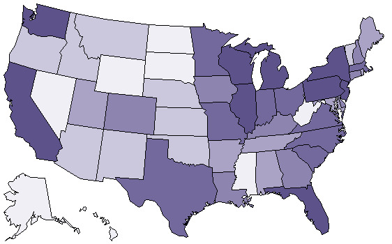
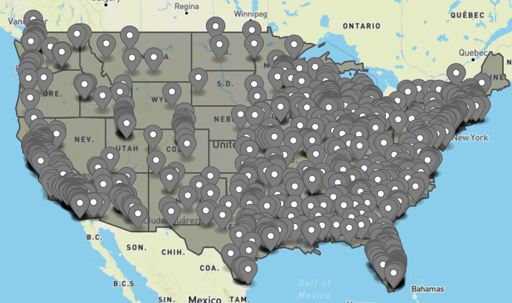

## HeatMap - Coloring Polygons
#### Due: 04-26-2022 (Tuesday @ 9:30 a.m.)

### Overview

Given the two files in the data folder: 
1. [cities.json](data/cities.json)
2. [states.geojson](data/states.geojson)

Create a **geoJson** file that shades each state based on the population in [cities.json](data/cities.json). Your color scheme is up to you, but there are 1000 cities with populations from `8,405,837 downto 36,877` so choosing the number of colors and type is up to you as long as there is some description or annotations that help explain your scheme. Here is an example that colors states based on some other criteria, but it should give you an idea.

Alaska and Hawaii are superimposed on this image in the wrong location. Your geoJson file will show them in the correct location.

Also, you will need to display the cities on our map. Using the typical geoJson point data type will give you something like: 

This is not acceptable. A simple point would be just great closer to a small circle or square or any small polygon. They should be colored as well based on the state they are in.

## Determining Color

The 1000 cities in the file provided do not have the state that they reside in, so you must do some kind of "point in polygon" test to see which cities go with each state. After you determine which state a city is in, you can calculate total population (not true population, but only based on the cities we have). Then you can update a states "color" based on the population. Choose 8-10 colors in some scheme and then decide how to discretize your state populations into those 8-10 buckets to assign color. 

## Color Reference
https://www.eggradients.com/color-names

